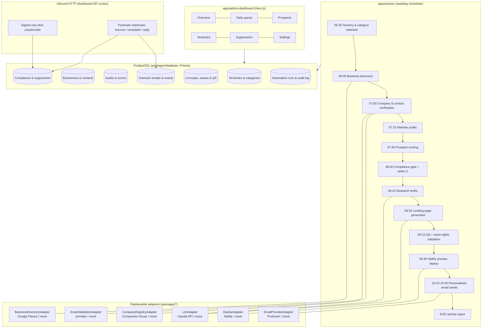

# Kent Site Prospector — Technical Architecture

Version 1.0 — 2026-07-21

## 1. Purpose

Kent Site Prospector (KSP) is an automated outbound website-design prospecting pipeline.
Each weekday it selects the next Kent territory + business category from a rotation queue,
discovers businesses through licensed APIs, verifies legal form via Companies House, audits
each business's existing web presence, scores prospects, passes them through a compliance
gate, selects exactly **two** qualified prospects, generates a bespoke landing-page concept
for each, deploys each concept to a private noindexed Netlify preview, sends one personalised
compliant outreach email per prospect, and logs every action.

Compliance controls are structural, not advisory: the pipeline is physically incapable of
emailing a prospect that has not passed the compliance gate, and the send path enforces the
two-per-weekday cap, weekday-only sending, UK business hours, idempotency and permanent
suppression at the database layer.

## 2. High-level system diagram



## 3. Monorepo layout

pnpm workspaces + strict TypeScript throughout. Every external integration sits behind an
interface in `packages/shared/src/adapters.ts`; concrete implementations live in feature
packages with a `real` and `mock` variant selected by configuration.

```
apps/
  admin-dashboard/     Next.js 14 dashboard + inbound HTTP endpoints (unsubscribe, webhooks)
  worker/              Weekday pipeline orchestrator (invoked by cron / GitHub Actions / systemd)
packages/
  shared/              Config (zod-validated env), logging, errors, adapter interfaces, utils
  database/            Prisma schema, migrations, seed data, repository helpers
  discovery/           Territory rotation, business-directory adapters, dedup engine
  compliance/          Legal-form classification, decision engine, suppression manager
  auditing/            Playwright website auditor, audit scoring, screenshots
  scoring/             Prospect scorer, disqualification engine, daily pair selection
  research/            Research-brief generation (LLM adapter), fact separation
  content-generation/  Industry strategy modules, landing-page generator, claims validator
  asset-management/    Asset-rights registry and publish gating
  deployment/          QA pipeline, Netlify adapter, expiry management
  email/               Email generator, provider adapters, unsubscribe signing, event handling
  analytics/           Daily and weekly report builders
docs/                  Architecture, compliance, privacy, security, operations, etc.
infrastructure/
  workflows/           GitHub Actions weekday schedule
  netlify/             Preview deploy scaffolding (_headers, robots.txt)
  monitoring/          Sentry setup notes, healthcheck script
```

## 4. Core design decisions

### 4.1 Database-enforced safety invariants

The riskiest failure modes (double-sending, contacting suppressed people, exceeding the daily
cap) are enforced in PostgreSQL, so no bug in application logic can violate them:

- `OutreachEmail.idempotencyKey` is UNIQUE. The key is deterministic:
  `first-contact:{businessId}:{contactId}`. A worker restart cannot create a second send row.
- `Suppression` rows are permanent; the compliance gate joins against suppression by email,
  domain and businessId inside the selection query itself.
- The daily cap is enforced by counting `OutreachEmail` rows with `sentAt` in the current
  UK-local day inside a serialised transaction holding a Postgres advisory lock
  (`pg_advisory_xact_lock`) — plus an application-level guard.
- Weekday/business-hours checks are evaluated in `Europe/London` at the moment of send,
  not at schedule time.

### 4.2 Compliance gate as a chokepoint

`packages/compliance` exposes a single function `evaluateProspect()` returning one of:
`CORPORATE_APPROVED | CONSENT_REQUIRED | MANUAL_REVIEW_REQUIRED | DO_NOT_CONTACT |
SUPPRESSED | IDENTITY_UNCONFIRMED | EMAIL_UNVERIFIED`. Only `CORPORATE_APPROVED` may enter
the outreach queue, and the email sender re-checks the decision AND the suppression table
immediately before send (time-of-check/time-of-use protection). Sole traders, ordinary
partnerships and unknown legal forms are never auto-emailed (UK PECR: the corporate-subscriber
rules only apply to incorporated bodies).

### 4.3 Fact provenance and the claims firewall

Everything the LLM is allowed to say about a business flows from a `ResearchBrief` object with
four disjoint sections: `verifiedFacts` (each with a source URL), `designRecommendations`,
`unknowns`, and `placeholders`. The landing-page generator and email generator receive ONLY
this object. A post-generation `ClaimsValidator` scans output for forbidden claim patterns
(awards, years in business, review scores not in verified facts, prices, guarantees,
health/legal/financial claims) and blocks deployment/sending on violation. This is a QA-critical
check — failure = no deploy, no email.

### 4.4 Asset rights gating

Every asset carries a `rightsStatus`. The QA pipeline extracts every image/font reference from
the generated concept and verifies each maps to a registered asset whose status is publishable
(`BUSINESS_OWNED_AND_PERMISSION_CONFIRMED`, `LICENSED_STOCK`, `PROVIDED_BY_OPERATOR`,
`GENERATED`, `PLACEHOLDER`). Anything sourced from social media / Google Images defaults to
`REFERENCE_ONLY` and cannot be published.

### 4.5 Concept previews that cannot deceive

Slug format `concept-{12-char random token}`; a validator rejects any slug containing a
normalised form of the business name. Every generated page includes: `<meta name="robots"
content="noindex, nofollow">`, `X-Robots-Tag` headers via `_headers`, `robots.txt` disallow
all, a permanently visible disclaimer banner ("Independent website concept prepared by
{AGENCY}. This is not the official website of {BUSINESS}."), password protection when the
Netlify plan supports it, and a DB-tracked `expiresAt` (default 30 days) after which the
worker replaces the deploy with a neutral "concept expired" page.

### 4.6 Pipeline stage model

Each `AutomationRun` records per-stage status. Stages are idempotent: each stage reads its
inputs from the DB, checks whether its output already exists (by natural key), and skips work
already done. A crashed run can be resumed by re-invoking the worker with the same runDate;
the advisory lock prevents concurrent duplicates. Failures push a `DeadLetter` row with the
stage payload for manual replay from the dashboard.

### 4.7 Configuration and production locks

`packages/shared/src/config.ts` zod-parses the environment. Three-tier mode:

- `APP_ENV=development` → mock adapters allowed, sending disabled unless `EMAIL_DRY_RUN=false`
  AND real provider key present AND agency identity complete.
- `APP_ENV=production` → refuses to boot with any mock adapter selected, refuses to boot
  without agency identity (name, postal address, website, phone), sender domain, and
  DKIM-verified provider configuration flags.
- `EMAIL_KILL_SWITCH=true` (settable from the dashboard Settings table too) halts all sending
  regardless of environment.

## 5. External integrations

| Concern | Default provider | Interface | Mock |
|---|---|---|---|
| Business discovery | Google Places API (New) | `BusinessDirectoryAdapter` | Deterministic fixture set per territory/category |
| Company registry | Companies House REST API | `CompanyRegistryAdapter` | Fixture company profiles |
| Email validation | Generic (ZeroBounce-compatible) | `EmailValidationAdapter` | Syntax+MX heuristic |
| LLM | Claude API (Anthropic SDK) | `LlmAdapter` | Deterministic template-based generator |
| Deployment | Netlify API | `DeployAdapter` | Local directory "deploys" + fake URL |
| Email sending | Postmark | `EmailProviderAdapter` | Writes .eml to outbox dir |
| Errors | Sentry | `initSentry()` no-op without DSN | — |

All real adapters implement retry with exponential backoff + jitter, respect provider rate
limits, and never fall back to scraping when an API fails.

## 6. Scheduling

Primary: GitHub Actions workflow (`infrastructure/workflows/daily-pipeline.yml`) with cron
`30 5 * * 1-5` (05:30 UTC ≈ 06:30 BST) invoking `pnpm --filter worker start -- --stage all`,
plus an hourly `expiry-and-events` job. Alternative: any cron host running the same commands.
The worker takes a Postgres advisory lock keyed on the run date, so overlapping invocations
are harmless. Email sends are scheduled at two independent random times within
10:15–15:30 Europe/London and executed by the hourly job, which re-validates every
precondition at send time.

## 7. Error handling model

- Typed error hierarchy (`KspError` → `RetryableError` / `FatalError` / `ComplianceError`).
- `withRetry()` wrapper: exponential backoff, max attempts, jitter; only `RetryableError`
  retries.
- Dead-letter queue table with replay tooling.
- Stage boundaries are transactions; state transitions are explicit and logged to
  `AuditLog` (append-only actor/action/entity/detail rows).
- Reconciliation: if a send succeeded but logging failed, the hourly job reconciles via
  the provider message ID before ever attempting a resend (and the idempotency key makes a
  duplicate send impossible anyway).

## 8. Security summary

Argon2id-hashed admin credentials + iron-session cookies, CSRF-safe same-site strict, RBAC
(ADMIN vs OPERATOR — only ADMIN can reverse suppression or change compliance settings), all
inbound webhook payloads verified (Postmark webhook auth token), signed HMAC unsubscribe
tokens (no DB lookup needed to honour an unsubscribe even under DB pressure — token embeds
email + businessId), strict security headers + CSP on the dashboard, secrets only via env,
`docs/security.md` covers the full checklist.

## 9. Privacy summary

Data minimisation (only public business data + generic business emails), retention sweeper
(rejected prospects' personal data anonymised after a configurable 90 days; suppression rows
retain only what is needed to keep suppressing), versioned policy documents stored in the
`PolicyDocument` table and editable in the dashboard, DSR/objection/deletion workflows in
`docs/privacy.md`. Open tracking is disabled by default; `openedAt` is only populated if the
operator explicitly enables tracking with a documented purpose.
