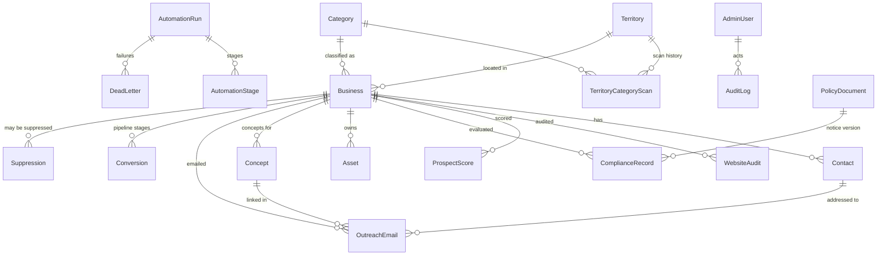

# Kent Site Prospector — Data Model

Source of truth: `packages/database/prisma/schema.prisma`. This document explains the
entities and shows the ERD. All timestamps are `timestamptz`; all IDs are cuid strings.

## Entity-relationship diagram

## Entities

**Territory** — one row per (local authority, town, outward postcode). Fields: localAuthority,
town, district, outwardPostcode, priority, status (`PENDING|ACTIVE|EXHAUSTED|PAUSED`),
lastScannedAt, nextScanAt, discoveredCount, qualifiedCount, contactedCount, convertedCount.
Territories are DB data, never hard-coded; seeded for 28+ Kent towns and editable in the
dashboard.

**Category** — configurable business categories with `providerTypes` (Google Places type
mapping), `strategyKey` (industry conversion-strategy module), status
(`ACTIVE|PAUSED|EXCLUDED`), priority.

**TerritoryCategoryScan** — the rotation queue. One row per (territory, category) pair with
position, status and result counts. The rotation planner picks the lowest-position `PENDING`
pair each weekday and marks it scanned; the following week continues from the queue rather
than restarting. The seeding alternates towns and category groups so wealthy towns/common
industries don't dominate.

**Business** — identity + discovery provenance: name, tradingName, legalName, companyNumber,
legalForm (`LTD|LLP|PLC|CHARITY|SOLE_TRADER|PARTNERSHIP|PUBLIC_BODY|UNKNOWN`), categoryId,
territoryId, address/town/postcode, phone, website, primaryEmail, socialProfiles (json),
providerPlaceId (unique per provider — dedup key), reviewCount, reviewRating, openingHours
(json), services (json), discoverySource, sourceUrl, discoveredAt, lastVerifiedAt,
dedupFingerprint (unique: normalised name+postcode), status.

**Contact** — name?, role?, email, emailType (`GENERIC|ROLE|PERSONAL`), validationStatus
(`UNVERIFIED|VALID|INVALID|RISKY`), source, lastVerifiedAt. Personal addresses are stored
only when a licensed source published them in a business capacity, and are never auto-used.

**WebsiteAudit** — auditDate, hasWebsite, technicalScore, designScore, conversionScore,
contentScore, seoScore, trustScore, opportunityScore, findingsJson (structured checks:
https, mobile viewport, broken links, meta tags, CTAs, contact visibility, copyright year,
cookie banner, legal pages…), evidenceJson (raw measurements), screenshotPaths, robotsAllowed.

**ProspectScore** — totalScore 0–100, scoringVersion, componentScores (json of the 8 weighted
components), disqualified, disqualificationReason, calculatedAt.

**ComplianceRecord** — legalForm at evaluation, decision (enum of the 7 statuses),
lawfulBasis (`LEGITIMATE_INTERESTS|CONSENT|NONE`), legitimateInterestAssessmentId,
privacyNoticeVersion, sourceOfPersonalData, decisionReason, checkedAt. Append-only —
re-evaluation creates a new row.

**Asset** — source, sourceUrl, licenceType, rightsStatus (`BUSINESS_OWNED_AND_PERMISSION_CONFIRMED|
LICENSED_STOCK|PROVIDED_BY_OPERATOR|GENERATED|PLACEHOLDER|REFERENCE_ONLY|PROHIBITED`),
attribution, localPath, intendedUse, expiryDate. Publish gate: only the first five statuses.

**Concept** — version, status (`DRAFT|QA_FAILED|QA_PASSED|DEPLOYED|EXPIRED|UNPUBLISHED`),
contentJson (research brief + section copy), htmlPath, repositoryPath, previewUrl,
deploymentId, deployedAt, expiresAt, screenshots (json), qaResults (json), slug (unique).

**OutreachEmail** — businessId, contactId, conceptId, sequence (1 = first contact),
idempotencyKey (unique, deterministic), subject, bodyText, bodyHtml, providerMessageId,
status (`DRAFT|QUEUED|SCHEDULED|SENT|DELIVERED|BOUNCED|COMPLAINED|REPLIED|UNSUBSCRIBED|
CANCELLED|BLOCKED`), scheduledAt, sentAt, deliveredAt, openedAt (nullable; only with
documented tracking purpose), clickedAt, repliedAt, bouncedAt, unsubscribedAt, complaintAt,
unsubscribeToken.

**Suppression** — email?, domain?, businessId?, reason (`UNSUBSCRIBED|COMPLAINT|HARD_BOUNCE|
OBJECTION|MANUAL|LEGAL`), source, createdAt, reversedAt, reversedBy. Active suppression =
`reversedAt IS NULL`. Reversal requires ADMIN and writes an AuditLog row.

**Conversion** — stage (`REPLIED|POSITIVE_REPLY|MEETING|PROPOSAL|WON|LOST`), estimatedValue,
actualValue, notes.

**AutomationRun / AutomationStage / DeadLetter** — one run per (runDate, runType); stages with
status/startedAt/completedAt/error; dead letters carry stage payload for replay.

**AdminUser / AuditLog** — dashboard users with role `ADMIN|OPERATOR`, append-only audit log
(actor, action, entityType, entityId, detailJson, at).

**Setting** — key/value app settings editable in the dashboard (daily cap, send window,
minimum scores, preview expiry days, kill switch, follow-ups enabled...). Values validated
against a zod registry.

**PolicyDocument** — versioned editable compliance documents (privacy notice, direct-marketing
policy, LIA, retention policy, data-source register, DSR/objection/deletion/incident
procedures). `ComplianceRecord.privacyNoticeVersion` references the version in force.

## Key invariants (DB-enforced)

1. `OutreachEmail.idempotencyKey` UNIQUE — no duplicate sends, ever.
2. `Business.dedupFingerprint` UNIQUE and `(discoverySource, providerPlaceId)` UNIQUE — no re-import duplicates.
3. `Concept.slug` UNIQUE.
4. Suppression checks are part of the candidate SELECT and the send transaction.
5. Two-per-day cap counted under `pg_advisory_xact_lock(hash(runDate))`.
